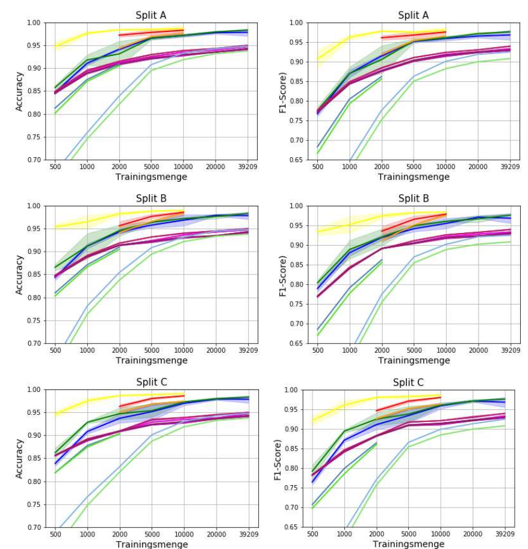
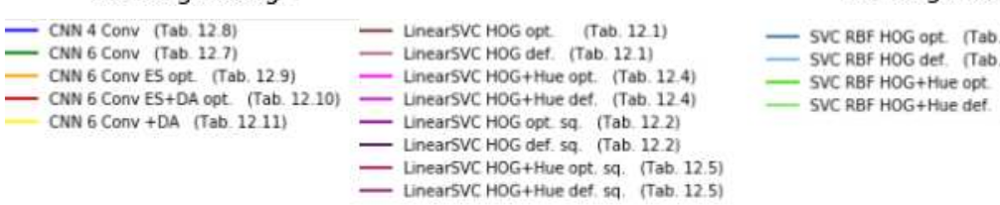
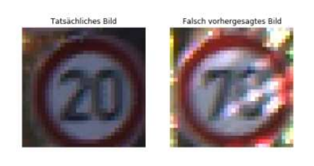
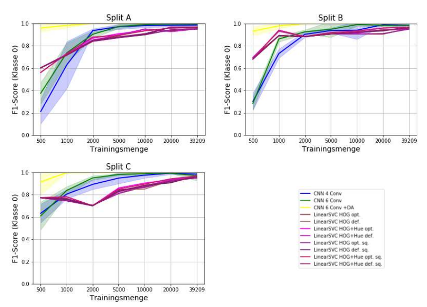
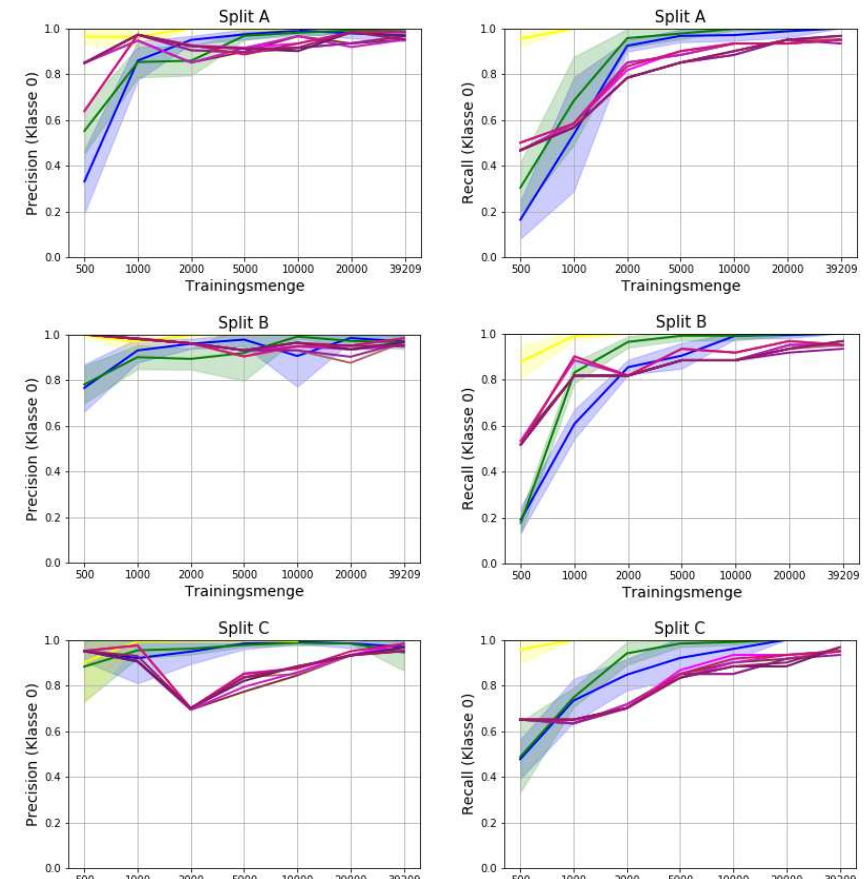

## Traffic Sign Classification using Deep Learning and Machine Learning

This project uses the German Traffic Sign Recognition Benchmark (GTSRB), a large dataset of more than
50,000 traffic sign images in 43 classes. The GTSRB is widely used for evaluating machine learning
and computer vision algorithms in the context of traffic sign recognition.

### Model Development and Optimization

Multiple SVM and CNN models were trained with varying amounts of training data to determine the threshold
at which one model type outperforms the other. Additionally, to ensure optimal performance, Grid Search was
utilized for hyperparameter tuning of select models.
Depending on the specific model requirements, image preprocessing techniques were applied, including image
enhancement and feature extraction. These preprocessing steps were implemented to improve the quality of input 
data and to extract relevant features, thereby potentially enhancing the overall performance of the models.

### Below are some sample images of the dataset.

### Class distribution:

The training dataset is imbalanced, with significant variations in the number of samples across different
traffic sign classes. This imbalance is an important characteristic of the GTSRB dataset and reflects the
real-world frequency of different traffic signs.

Key points about the class distribution:
1. Some classes are overrepresented with thousands of samples.
2. Other classes are underrepresented with only a few hundred samples.
3. This imbalance can affect model performance and requires careful consideration during training and evaluation.

To address this imbalance, I employed techniques such as using class weights and Data augmentation.

### Stratified Class Density Visualization (500 Images)

### Stratified Class Density Visualization (whole dataset)

### Histogram equalization

The pictures were taken under various weather conditions, and the contrast of low-contrast images was enhanced through histogram 
equalization, a technique that redistributes pixel intensity values.

### HOG-Features

The SVMs were trained using HOG features extracted from the images, among other features

### Classification results as a function of the training set

The best results were achieved with a CNN with 6 layers and data augmentation up to the original total amount.

#### Example: minority class 0
On the left the image to be classified, on the right the misclassified image.

#### Classification results of the minority class 0

  

